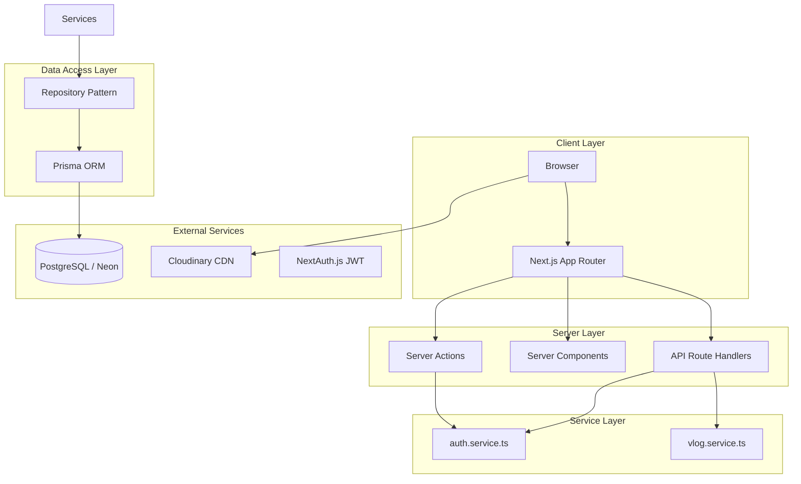
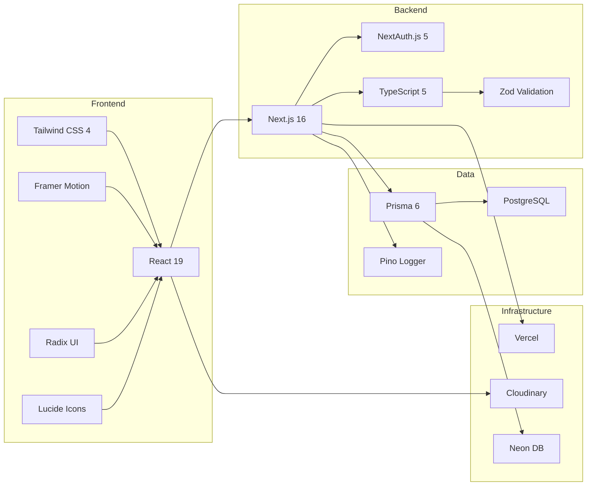
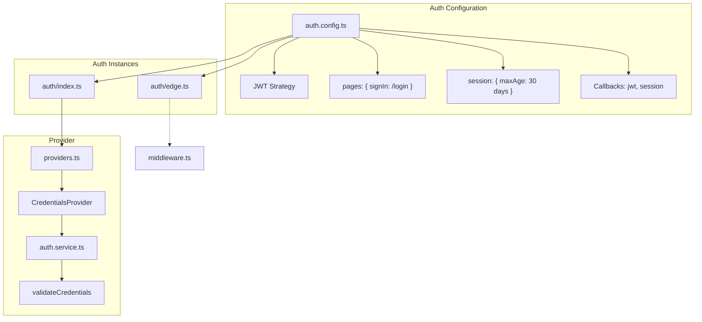
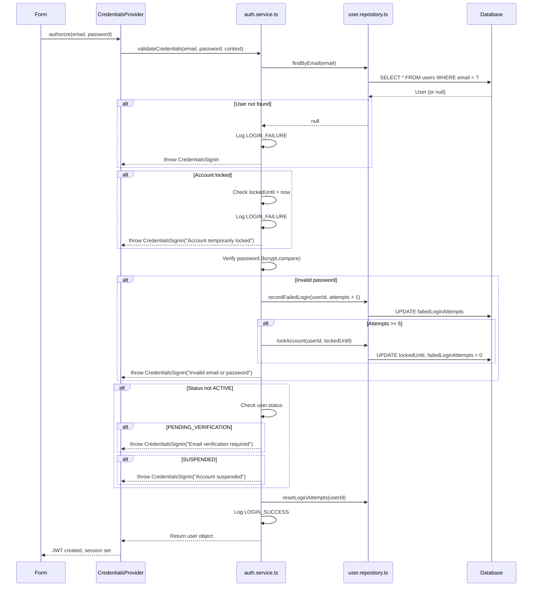
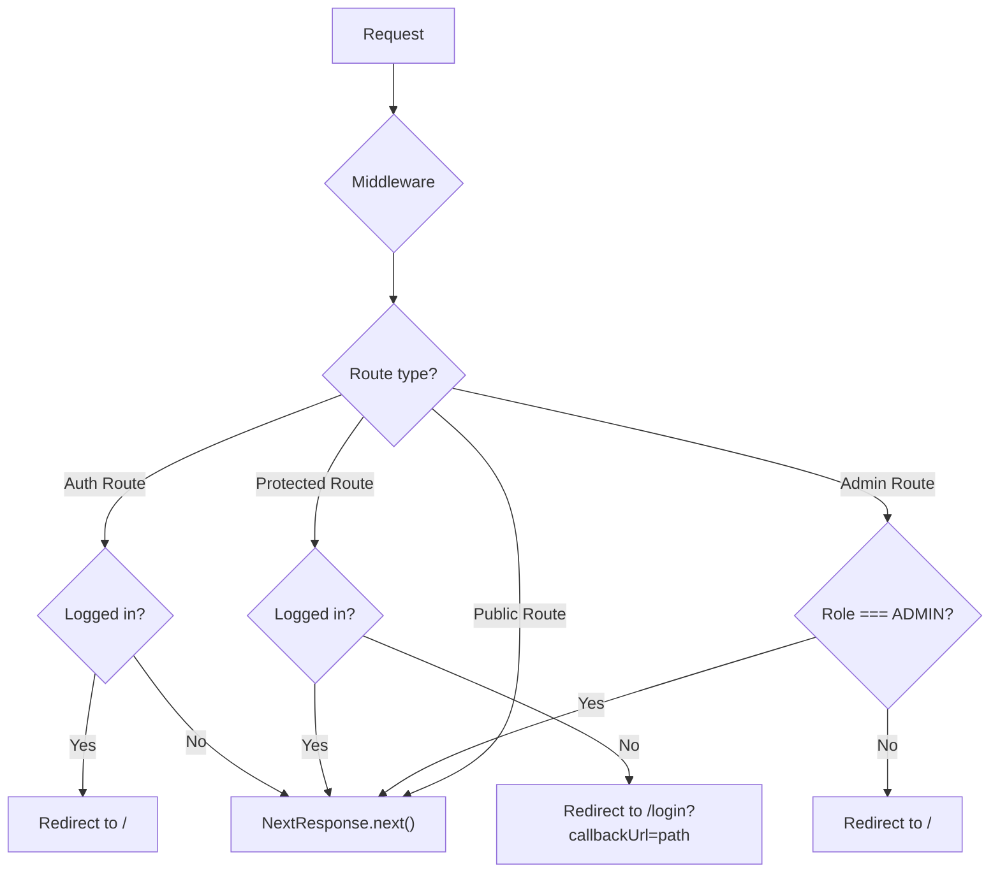
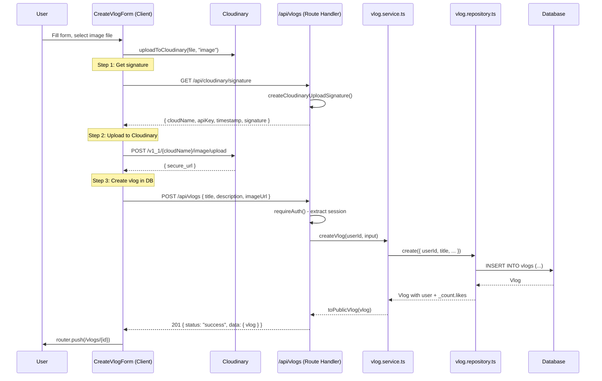
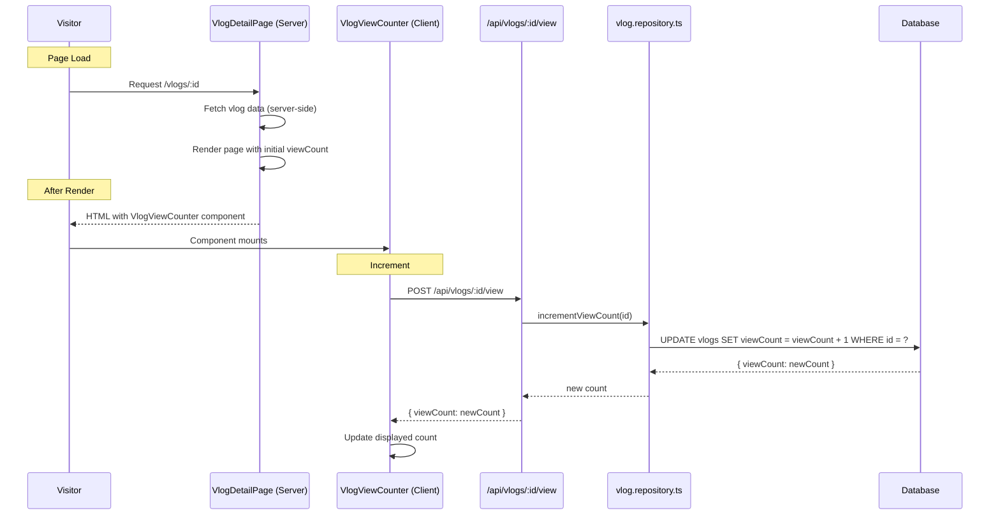
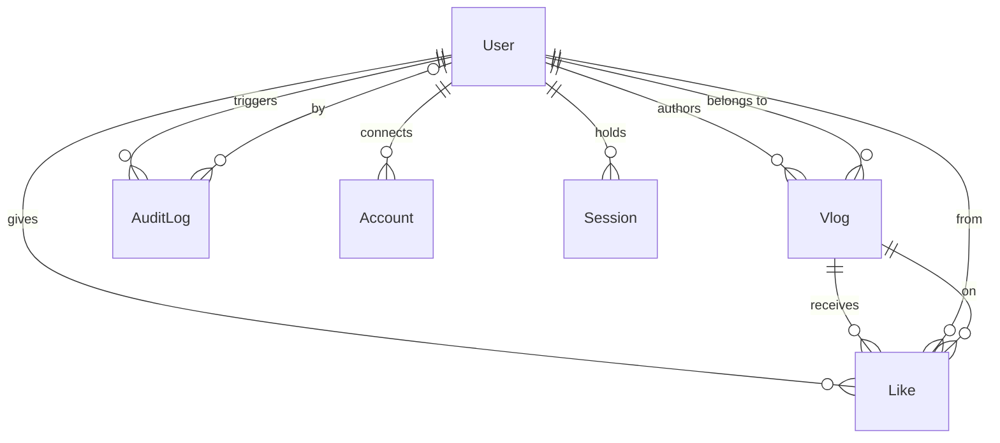
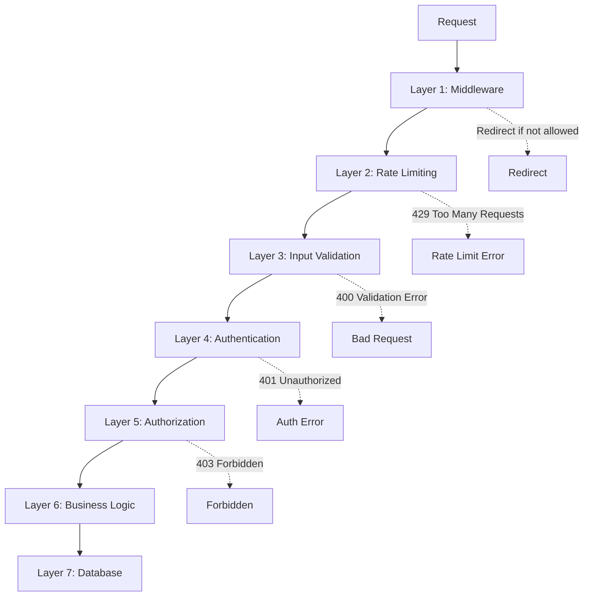
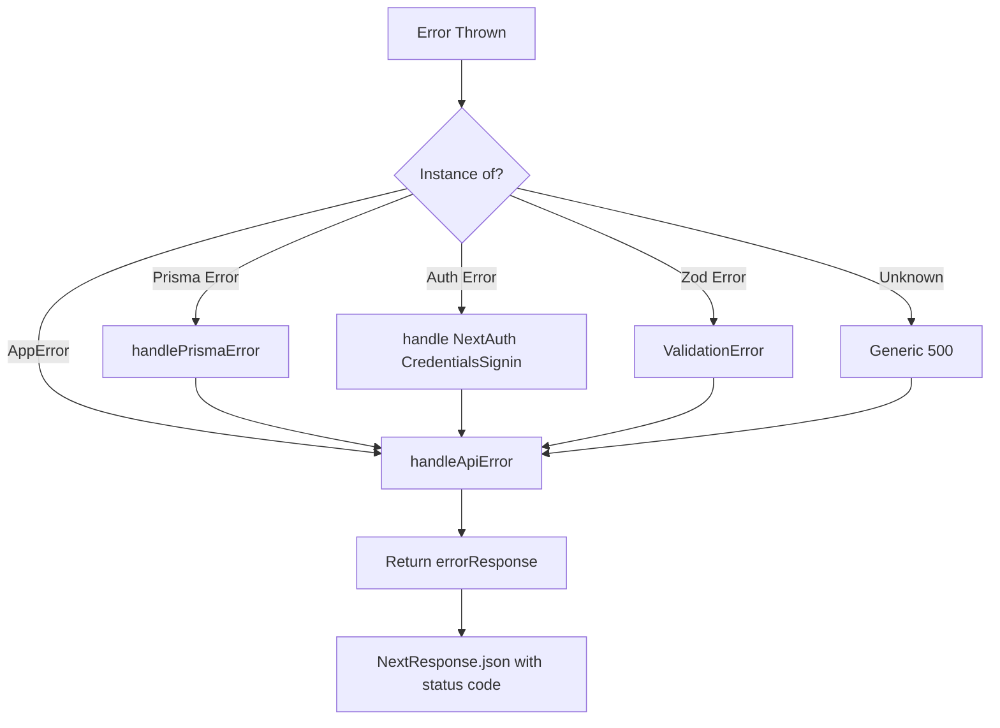

# 🏗 Snapora — Architecture Guide

**Complete system architecture, component design, data flow, and module documentation.**

---

## 📋 Table of Contents

- [System Overview](#-system-overview)
- [Technology Architecture](#-technology-architecture)
- [Project Structure](#-project-structure)
- [Application Layer Architecture](#-application-layer-architecture)
- [Authentication Flow](#-authentication-flow)
- [Data Flow](#-data-flow)
- [Component Architecture](#-component-architecture)
- [API Architecture](#-api-architecture)
- [Database Architecture](#-database-architecture)
- [Security Architecture](#-security-architecture)
- [Error Handling Strategy](#-error-handling-strategy)
- [Logging Strategy](#-logging-strategy)
- [Design Decisions](#-design-decisions)

---

## 🎯 System Overview

Snapora is a **monolithic Next.js application** that serves both the frontend (React Server/Client Components) and backend (API route handlers) from a single deployment on Vercel.



### Key Architectural Characteristics

| Characteristic | Approach |
|----------------|----------|
| **Pattern** | Monolithic with clean service/repository separation |
| **Rendering** | Server Components by default, Client Components for interactivity |
| **Data Flow** | Server Components fetch data directly; Client Components use API routes |
| **Authentication** | JWT-based sessions (stateless, no DB lookup) |
| **State Management** | React `useActionState` for forms, session context for auth |
| **API Design** | RESTful JSON endpoints under `/api/*` |

---

## 🛠 Technology Architecture



### Version Matrix

| Dependency | Version | Purpose |
|------------|---------|---------|
| Next.js | 16.2.7 | App Router, Server Components, API Routes |
| React | 19.2.4 | UI rendering |
| TypeScript | ^5 | Type safety |
| Prisma | ^6.19.3 | ORM, migrations |
| NextAuth.js | ^5.0.0-beta.31 | Authentication |
| Tailwind CSS | ^4 | Utility-first CSS |
| Framer Motion | ^12.40.0 | Animations |
| Zod | ^4.4.3 | Schema validation |
| Pino | ^10.3.1 | Structured logging |
| bcrypt | ^6.0.0 | Password hashing |
| Cloudinary | — | Image/video upload |

---

## 📁 Project Structure

```
src/
├── actions/                    # Next.js Server Actions
│   └── auth.actions.ts         #   - loginAction, registerAction, logoutAction
│
├── app/                        # Next.js App Router (pages + API)
│   ├── (auth)/                 # Auth page group
│   │   ├── login/              #   Login page
│   │   ├── register/           #   Register page
│   │   ├── forgot-password/    #   Password reset request
│   │   └── reset-password/    #   Password reset confirm
│   ├── api/                    # API Route Handlers
│   │   ├── auth/               #   Auth endpoints (register, signin, etc.)
│   │   ├── cloudinary/         #   Signature endpoint
│   │   ├── profile/            #   Profile CRUD
│   │   └── vlogs/              #   Vlog CRUD + like/view
│   ├── create-vlog/            #   Create vlog page (re-exports)
│   ├── profile/                #   Own profile page
│   ├── users/[id]/             #   Public user profile
│   ├── vlogs/                  #   Vlog pages (list, detail, new, edit)
│   │   ├── page.tsx            #     Browse vlogs (paginated)
│   │   ├── new/page.tsx        #     Create vlog form
│   │   └── [id]/              #     Detail + edit pages
│   ├── layout.tsx              # Root layout (providers, navbar, footer)
│   ├── page.tsx                # Landing page
│   └── globals.css             # Design tokens, theme, animations
│
├── auth/                       # NextAuth.js configuration
│   ├── auth.config.ts          #   Edge-safe config (middleware)
│   ├── index.ts                #   Server-side auth instance
│   ├── edge.ts                 #   Edge middleware instance
│   └── providers.ts            #   CredentialsProvider
│
├── components/                 # React components
│   ├── auth/                   #   LoginForm, RegisterForm, ProfileForm
│   ├── layout/                 #   Navbar, Footer
│   ├── ui/                     #   Button, Input, Card, Badge, etc.
│   └── vlogs/                  #   VlogCard, CreateForm, EditForm, LikeButton, ViewCounter
│
├── constants/                  # Application constants
│   ├── auth.constants.ts       #   bcrypt rounds, rate limits, lock duration
│   └── routes.constants.ts     #   Public, protected, admin route lists
│
├── lib/                        # Core libraries
│   ├── auth/                   #   Password hashing, session helpers, env
│   ├── errors/                 #   AppError, AuthError, DatabaseError, ValidationError
│   ├── logger/                 #   Pino loggers (api.logger, auth.logger)
│   ├── prisma/                 #   Prisma client singleton
│   ├── utils/                  #   API responses, rate limiting, request context
│   └── validators/             #   Zod schemas (auth.schemas, vlog.schemas)
│
├── middleware.ts               # Route protection (deprecated in Next.js 16)
│
├── providers/                  # React context providers
│   └── session-provider.tsx    #   SessionProvider wrapper
│
├── repositories/               # Data access layer
│   ├── user.repository.ts      #   User CRUD + login tracking
│   ├── vlog.repository.ts      #   Vlog CRUD + view count + featured
│   ├── like.repository.ts      #   Like/unlike operations
│   ├── audit-log.repository.ts #   Security audit trail
│   └── verification-token.repository.ts  # Email/password reset tokens
│
├── services/                   # Business logic layer
│   ├── auth.service.ts         #   Register, login, verify, reset, profile
│   └── vlog.service.ts         #   CRUD, like/unlike, view count
│
└── types/                      # TypeScript type definitions
    ├── user.types.ts           #   PublicUser
    └── vlog.types.ts           #   PublicVlog
```

---

## 🧱 Application Layer Architecture

### Layer Responsibilities

```
┌─────────────────────────────────────┐
│         Presentation Layer          │
│  Pages (Server Components)          │
│  Re-rendered per request            │
├─────────────────────────────────────┤
│        Client Components            │
│  "use client" — interactivity       │
│  Forms, buttons, dynamic UI         │
├─────────────────────────────────────┤
│       API Route Handlers            │
│  app/api/*/route.ts                 │
│  Request parsing, session check     │
├─────────────────────────────────────┤
│       Server Actions                │
│  actions/auth.actions.ts            │
│  Forms with useActionState          │
├─────────────────────────────────────┤
│        Service Layer                │
│  Business logic, validation,        │
│  authorization checks               │
├─────────────────────────────────────┤
│        Repository Layer             │
│  Data access (Prisma queries)       │
│  Mapping, filtering, pagination     │
├─────────────────────────────────────┤
│         External Layer              │
│  PostgreSQL, Cloudinary, NextAuth   │
└─────────────────────────────────────┘
```

### Data Flow Patterns

**Pattern A: Server Component → Repository → Database**

Used for: Displaying data on pages (no interactivity required)

```
Server Component [app/vlogs/page.tsx]
    ↓  Direct import (no API call)
Service [vlogService.getAllVlogs()]
    ↓
Repository [vlogRepository.findMany()]
    ↓
Prisma → PostgreSQL
    ↓  Returns typed data
Server Component renders HTML
```

**Pattern B: Client Component → API Route → Service → Repository**

Used for: Interactive operations (create, edit, like, delete)

```
Client Component [CreateVlogForm.tsx]
    ↓  fetch() POST /api/vlogs
API Route [app/api/vlogs/route.ts]
    ↓  Validate session, parse body
Service [vlogService.createVlog()]
    ↓  Business logic
Repository [vlogRepository.create()]
    ↓
Prisma → PostgreSQL
    ↓  Returns data
API Route → JSON Response
    ↓
Client Component updates UI
```

**Pattern C: Server Action → Service → Repository**

Used for: Form submissions (login, register)

```
Form [LoginForm.tsx]
    ↓  action={loginAction}
Server Action [auth.actions.ts]
    ↓  Parse, validate, call service
Service [authService.validateCredentials()]
    ↓
Repository [userRepository.findByEmail()]
    ↓
Prisma → PostgreSQL
    ↓
Server Action returns result
    ↓
Form displays success/error
```

---

## 🔐 Authentication Flow

### Auth Architecture



### JWT Token Structure

```typescript
// JWT Callback adds these fields
interface CustomToken {
  id: string;       // User ID
  role: UserRole;   // "USER" | "ADMIN"
  status: UserStatus; // "ACTIVE" | "PENDING_VERIFICATION" | etc.
}

// Session Callback maps token to session
interface CustomSession {
  user: {
    id: string;
    role: UserRole;
    status: UserStatus;
    name: string;
    email: string;
  };
}
```

### Session Cookie

| Property | Development | Production |
|----------|-------------|------------|
| **Name** | `authjs.session-token` | `__Secure-authjs.session-token` |
| **httpOnly** | ✅ | ✅ |
| **secure** | ❌ | ✅ |
| **sameSite** | `lax` | `lax` |

### Credential Validation Flow



### Route Protection (Middleware)



### Auth Routes Configuration

```typescript
// src/constants/routes.constants.ts
export const AUTH_ROUTES = ["/login", "/register"];
export const PROTECTED_ROUTES = ["/profile", "/create-vlog", "/vlogs/new"];
export const ADMIN_ROUTES = ["/admin"];
```

---

## 🔄 Data Flow

### Create Vlog (Complete Flow)



### View Count Flow



### Like/Unlike Flow

```mermaid
sequenceDiagram
    participant U as User
    participant LB as VlogLikeButton (Client)
    participant API as /api/vlogs/:id/like
    participant VS as vlog.service.ts
    participant LR as like.repository.ts
    participant DB as Database
    
    U->>LB: Click heart button
    
    alt Not authenticated
        LB->>U: Redirect to /login
    end
    
    LB->>API: POST /api/vlogs/:id/like
    API->>API: requireAuth()
    API->>VS: likeVlog(vlogId, userId)
    VS->>LR: findByUserAndVlog(userId, vlogId)
    LR->>DB: SELECT unique on (userId, vlogId)
    
    alt No existing like
        DB-->>LR: null
        VS->>LR: create(userId, vlogId)
        LR->>DB: INSERT INTO likes (...)
        DB-->>LR: Like
        VS->>LR: countByVlog(vlogId)
        LR->>DB: SELECT COUNT(*) FROM likes WHERE vlogId = ?
        DB-->>LR: count
        VS-->>API: { liked: true, likeCount: count }
        API-->>LB: 201 { liked: true, likeCount }
        LB->>LB: Show filled heart, update count
    else Already liked
        Note: This is actually unlike
        DB-->>LR: Existing like
        VS->>LR: delete(like.id)
        LR->>DB: DELETE FROM likes WHERE id = ?
        VS-->>API: { liked: false, likeCount: count }
        API-->>LB: 200 { liked: false, likeCount }
        LB->>LB: Show empty heart, update count
    end
```

---

## 🧩 Component Architecture

### Component Hierarchy

```
RootLayout
├── ThemeProvider (Client)
│   └── AppSessionProvider (Client)
│       ├── Navbar (Client)
│       │   ├── Logo
│       │   ├── NavLinks
│       │   ├── ThemeToggle
│       │   └── UserMenu / AuthButtons
│       │       ├── SessionStatus
│       │       ├── UserDropdown
│       │       └── SignOutButton
│       ├── Main Content (Server by default)
│       │   ├── LandingPage (Server)
│       │   │   ├── HeroSection
│       │   │   ├── StatsGrid
│       │   │   ├── FeaturedStories
│       │   │   ├── FeaturedCreators
│       │   │   ├── FeaturesGrid
│       │   │   ├── Testimonials
│       │   │   └── FinalCTA
│       │   ├── LoginPage → LoginForm (Client)
│       │   ├── RegisterPage → RegisterForm (Client)
│       │   ├── VlogsPage (Server)
│       │   │   ├── PaginationBar
│       │   │   └── VlogCard[]
│       │   ├── VlogDetailPage (Server)
│       │   │   ├── VlogViewCounter (Client)
│       │   │   ├── VlogLikeButton (Client)
│       │   │   └── AuthorInfo
│       │   ├── ProfilePage (Server) → ProfileForm (Client)
│       │   ├── PublicProfilePage (Server)
│       │   └── Create/Edit Vlog (Server) → Forms (Client)
│       └── Footer
```

### Server vs Client Component Distribution

| Type | Server Components | Client Components |
|------|-------------------|-------------------|
| **Location** | `app/*/page.tsx` (default) | Marked with `"use client"` |
| **Data** | Direct DB access via services | `fetch()` to API routes |
| **State** | URL params, search params | `useState`, `useActionState` |
| **Effects** | N/A | `useEffect` for post-mount actions |
| **Examples** | Landing page, Vlog list, Detail pages | Forms, Like/View buttons, Navbar |

### Client Components Breakdown

| Component | File | Why Client |
|-----------|------|------------|
| `Navbar` | `components/layout/navbar.tsx` | Session state, theme toggle, mobile menu, user dropdown |
| `Footer` | `components/layout/footer.tsx` | Dynamic year — could be Server |
| `LoginForm` | `components/auth/login-form.tsx` | `useActionState`, `useEffect` redirect |
| `RegisterForm` | `components/auth/register-form.tsx` | `useActionState`, Cloudinary upload, checkbox state |
| `ProfileForm` | `components/auth/profile-form.tsx` | Form state, mutation |
| `CreateVlogForm` | `components/vlogs/create-vlog-form.tsx` | File upload, form state, transitions |
| `EditVlogForm` | `components/vlogs/edit-vlog-form.tsx` | Form state, Cloudinary upload, delete confirm |
| `VlogLikeButton` | `components/vlogs/vlog-like-button.tsx` | Mutate like state, click handler |
| `VlogViewCounter` | `components/vlogs/vlog-view-counter.tsx` | POST on mount to increment view |
| `ThemeProvider` | `components/theme-provider.tsx` | Custom theme context (replaces next-themes) |
| `SessionProvider` | `providers/session-provider.tsx` | Wraps NextAuth SessionProvider |

### UI Component Library

| Component | Props | Variants |
|-----------|-------|----------|
| `Button` | `variant`, `size`, `disabled` | `primary`, `secondary`, `outline`, `ghost`, `destructive` |
| `Input` | `type`, `placeholder`, `error` | — |
| `Label` | `htmlFor` | — |
| `Textarea` | `rows`, `error` | — |
| `Checkbox` | `checked`, `onCheckedChange` | — |
| `Badge` | `variant` | `primary`, `secondary`, `outline` |
| `Card` | — | Variants via className |
| `Container` | `size` | `sm`, `md`, `lg`, `full` |
| `Section` | `title`, `subtitle`, `action`, `variant` | `default`, `muted` |
| `EmptyState` | `icon`, `title`, `description`, `action`, `size` | `sm`, `lg` |
| `Skeleton` | — | Pulse animation |
| `StatsCard` | `value`, `label`, `trend` | Positive/negative trend |
| `CreatorCard` | `name`, `username`, `storyCount`, `image` | Gradient avatar fallback |
| `GradientText` | Children | Applies gradient to text |
| `VlogCard` | `vlog: PublicVlog` | Link wrapper |
| `VlogViewCounter` | `vlogId`, `initialViewCount` | Increments on mount |
| `VlogLikeButton` | `vlogId`, `initialLikeCount`, `initialLiked`, `isAuthenticated` | Toggle like/unlike |

---

## 📡 API Architecture

### Route Handler Pattern

Every API route follows a consistent pattern:

```typescript
// app/api/vlogs/route.ts — Example pattern
export async function POST(request: NextRequest) {
  const path = "/api/vlogs";

  try {
    // 1. Auth check (if protected)
    const session = await requireAuth();

    // 2. Parse & validate body
    const body = parseBody(createVlogSchema, await request.json());

    // 3. Business logic
    const vlog = await vlogService.createVlog(session.user.id, body);

    // 4. Standardized response
    return successResponse({ vlog }, 201);
  } catch (error) {
    // 5. Centralized error handling
    return handleApiError(error, { method: "POST", path });
  }
}
```

### Response Format

**Success:**
```json
{
  "status": "success",
  "data": { ... }
}
```

**Error:**
```json
{
  "status": "error",
  "message": "Human-readable error message",
  "errors": {
    "fieldName": ["Validation error 1", "Validation error 2"]
  }
}
```

### API Route Map

```
METHOD  PATH                            AUTH    HANDLER
GET     /api/vlogs                      ❌      vlogService.getAllVlogs()
POST    /api/vlogs                      ✅      vlogService.createVlog()
GET     /api/vlogs/:id                  ❌      vlogService.getVlogById()
PUT     /api/vlogs/:id                  ✅      vlogService.updateVlog()
DELETE  /api/vlogs/:id                  ✅      vlogService.deleteVlog()
POST    /api/vlogs/:id/like             ✅      vlogService.likeVlog()
DELETE  /api/vlogs/:id/like             ✅      vlogService.unlikeVlog()
POST    /api/vlogs/:id/view             ❌      vlogService.incrementViewCount()
POST    /api/auth/register              ❌      authService.register()
POST    /api/auth/signin                ❌      signIn("credentials")
POST    /api/auth/signout               ✅      signOut()
POST    /api/auth/forgot-password       ❌      authService.requestPasswordReset()
POST    /api/auth/reset-password        ❌      authService.resetPassword()
POST    /api/auth/verify-email          ❌      authService.verifyEmail()
GET     /api/profile                    ✅      authService.getProfile()
PUT     /api/profile                    ✅      authService.updateProfile()
GET     /api/cloudinary/signature       ✅      buildCloudinarySignaturePayload()
```

---

## 🗄 Database Architecture

### Complete Schema (Prisma)

```prisma
// Core entities: User, Account, Session, VerificationToken
// Content entities: Vlog
// Engagement entities: Like
// Audit entities: AuditLog

model User {
  id                  String          @id @default(cuid())
  name                String
  username            String?         @unique
  email               String          @unique
  emailVerified       DateTime?
  password            String
  image               String?
  role                UserRole        @default(USER)
  status              UserStatus      @default(PENDING_VERIFICATION)
  failedLoginAttempts Int             @default(0)
  lockedUntil         DateTime?
  bio                 String?
  website             String?
  twitter             String?
  consentAcceptedAt   DateTime?
  createdAt           DateTime        @default(now())
  updatedAt           DateTime        @updatedAt
  deletedAt           DateTime?
  
  accounts    Account[]
  sessions    Session[]
  vlogs       Vlog[]
  likes       Like[]
  auditLogs   AuditLog[]
}
```

### Entity Relationships



### Index Strategy

| Table | Index | Purpose |
|-------|-------|---------|
| `users` | `email` | Login lookup |
| `users` | `status` | Filter by active/pending |
| `users` | `role` | Admin queries |
| `users` | `deletedAt` | Soft-delete filtering |
| `vlogs` | `userId` | Profile page queries |
| `vlogs` | `createdAt DESC` | Feed ordering |
| `vlogs` | `deletedAt` | Soft-delete filtering |
| `likes` | `(userId, vlogId)` UNIQUE | Prevent duplicate likes |
| `likes` | `vlogId` | Count likes per vlog |
| `likes` | `userId` | User's liked vlogs |
| `verification_tokens` | `identifier` | Lookup by email |
| `verification_tokens` | `expires` | Cleanup expired tokens |
| `audit_logs` | `userId` | User audit trail |
| `audit_logs` | `action` | Filter by action type |
| `audit_logs` | `createdAt DESC` | Time-ordered logs |

---

## 🔒 Security Architecture

### Layers of Security



### Security Measures Implemented

| Measure | Implementation | Location |
|---------|---------------|----------|
| **Password Hashing** | bcrypt (cost factor 12) | `src/lib/auth/password.ts` |
| **Session Security** | httpOnly, secure (prod), sameSite cookies | `src/auth/auth.config.ts` |
| **Rate Limiting** | In-memory token bucket, 10 req/min/IP for auth | `src/lib/utils/rate-limit.ts` |
| **Account Lockout** | Lock after 5 failed attempts for 15 min | `src/services/auth.service.ts` |
| **Input Validation** | Zod schemas with type coercion | `src/lib/validators/` |
| **Auth Enforcement** | `requireAuth()` throws 401 if no session | `src/lib/auth/session.ts` |
| **Owner Checks** | Compare `session.user.id` with resource owner | `src/services/vlog.service.ts` |
| **Soft Deletes** | `deletedAt` instead of hard delete | `src/repositories/vlog.repository.ts` |
| **Audit Logging** | All auth events logged | `src/repositories/audit-log.repository.ts` |
| **Environment Validation** | Zod schema for required env vars | `src/lib/validators/env.schema.ts` |
| **CORS Protection** | Server-side only (no public CORS) | Implicit via Next.js |
| **HTTPS** | Enforced by Vercel | Infrastructure |

---

## ⚠️ Error Handling Strategy

### Error Class Hierarchy

```typescript
AppError (base)
├── AuthenticationError (401)
├── AuthorizationError (403)
├── NotFoundError (404)
├── ConflictError (409)
├── ValidationError (400)
└── DatabaseError (500)
```

### Error Handling Flow



### Error Response Format

```json
{
  "status": "error",
  "message": "Human-readable error message",
  "errors": {
    "title": ["Title is required"],
    "email": ["Valid email is required"]
  }
}
```

### Error Codes

| Code | HTTP Status | Meaning |
|------|-------------|---------|
| `UNAUTHORIZED` | 401 | Not authenticated |
| `FORBIDDEN` | 403 | Not authorized (wrong owner) |
| `NOT_FOUND` | 404 | Resource doesn't exist |
| `CONFLICT` | 409 | Duplicate email, duplicate like |
| `VALIDATION_ERROR` | 400 | Invalid input |
| `DATABASE_ERROR` | 500 | Database operation failed |

---

## 📝 Logging Strategy

### Logger Architecture

```typescript
// src/lib/logger/index.ts
export const apiLogger = // Pino logger for API requests
export const authLogger = // Pino logger for auth events
```

### Logged Events

| Event | Logger | Level | Data |
|-------|--------|-------|------|
| API request start | `apiLogger` | `info` | method, path, ip |
| API request success | `apiLogger` | `info` | method, path, duration |
| API request error | `apiLogger` | `error` | method, path, error |
| Database error | `apiLogger` | `error` | operation, error |
| Login success | `authLogger` | `info` | userId, email |
| Login failure | `authLogger` | `warn` | email, reason |
| Registration | `authLogger` | `info` | userId, email |
| Password reset | `authLogger` | `info` | email |
| Account locked | `authLogger` | `warn` | userId |
| Session created | `authLogger` | `info` | userId |
| Unauthorized access | `authLogger` | `warn` | pathname |

---

## 💡 Design Decisions

| Decision | Alternative | Why Chosen |
|----------|-------------|------------|
| **Monolithic Next.js** | Separate frontend/backend | Single deploy, shared types, no CORS, faster development |
| **JWT Sessions** | Database sessions | No DB lookup per request, faster API, stateless |
| **Server Components** | All Client Components | Smaller bundles, better SEO, faster FCP |
| **Repository Pattern** | Direct Prisma in services | Separation of concerns, testable data access |
| **Service Layer** | Logic in route handlers | Reusable business logic, cleaner route handlers |
| **Zod Validation** | Manual validation | Type inference, composable schemas, clear error messages |
| **Soft Deletes** | Hard deletes | Data recovery, audit trails, referential integrity |
| **CUID Primary Keys** | Auto-increment integers | Non-predictable, distributed-friendly, collision-resistant |
| **Atomic View Count** | Separate views table | Simpler, faster for current scale |
| **Pino Logging** | Console.log | Structured JSON logs, log levels, performance |
| **Custom Theme Provider** | next-themes | Full control, no hydration mismatch, simple API |
| **Cloudinary Direct Upload** | Server-side upload | Reduces server load, better UX, scalable |

---

<div align="center">
  <sub>Snapora Architecture Guide · Version 1.0</sub>
</div>
