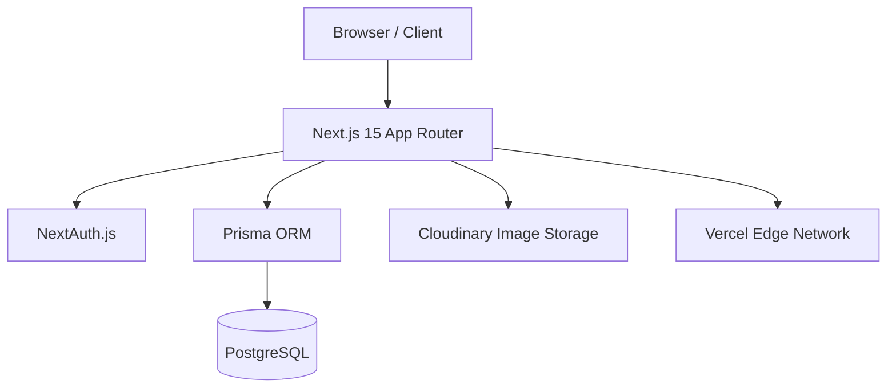
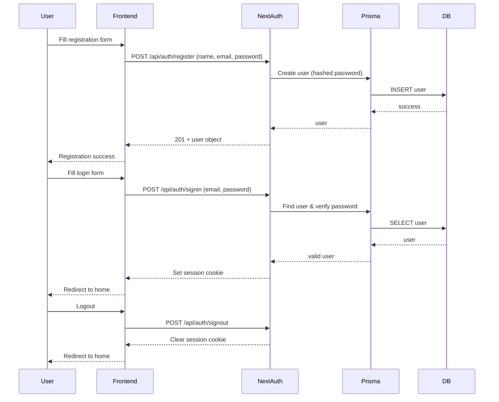
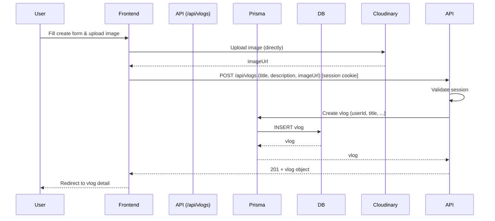
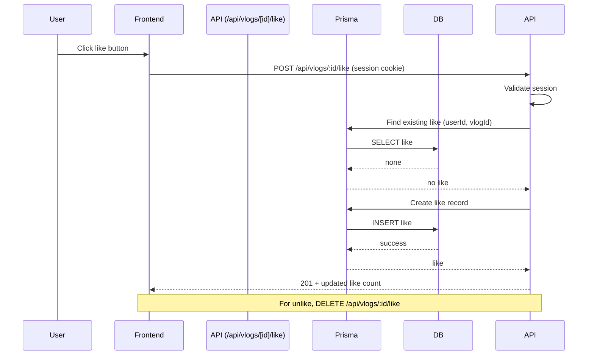
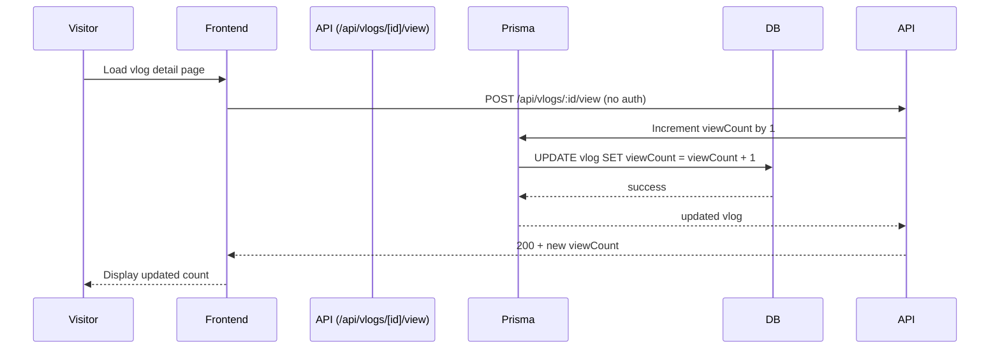

# System Architecture – Snapora

## High-Level System Architecture

The application follows a monolithic architecture with Next.js serving both the frontend and backend (API routes). External services are used for authentication (NextAuth.js), database (PostgreSQL via Prisma), and image storage (Cloudinary).

- **Next.js App Router**: handles routing, server‑side rendering, API endpoints, and React components.
- **NextAuth.js**: manages authentication sessions and credentials validation.
- **Prisma**: provides type‑safe database access and migration tooling.
- **PostgreSQL**: persistent storage for users, vlogs, and likes.
- **Cloudinary**: stores and serves cover images; the frontend uploads directly, receiving a secure URL.

## Request Flow

A typical request for viewing a vlog detail page:

1. User visits `/vlogs/[id]`.
2. Next.js server component or server action fetches the vlog from the database using Prisma.
3. The view count is incremented server‑side (via a server action or API call) before returning the page.
4. The page is rendered on the server (SSR) and sent to the client with pre‑fetched data.
5. For authenticated actions (like, create), the client sends requests to API routes; the API validates the session using NextAuth and then performs the DB operation.

## Component Overview

- **Layouts & Pages**: Server‑side rendered React components (App Router).
- **API Routes**: Route handlers under `app/api/` that implement REST endpoints.
- **Auth Configuration**: `auth.ts` exports NextAuth configuration and handlers.
- **Prisma Client**: Singleton instance used across the application.
- **Middleware**: Next.js middleware (optional) can protect routes by redirecting unauthenticated users.

## Authentication Flow

## Vlog Management Flow (Create)

## Like System Flow

## View Count Flow

---
