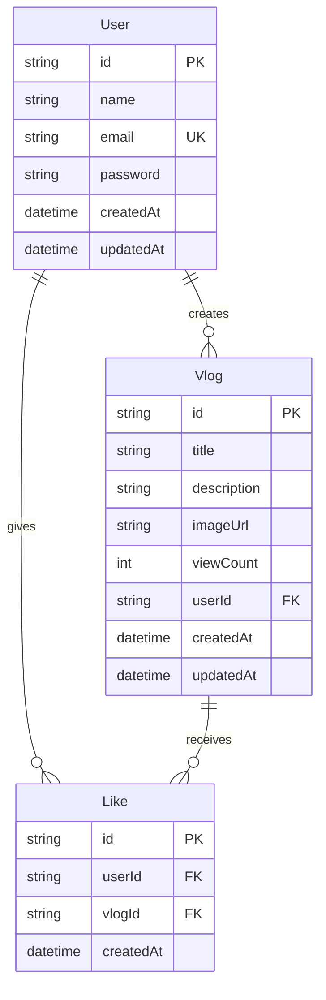

## docs/db-design.md

# Database Design – Snapora

## Overview

Snapora uses PostgreSQL as the primary data store, accessed via Prisma ORM. The database schema is defined in `prisma/schema.prisma` and managed through Prisma Migrate. The design follows normalised principles to support users, vlogs, likes, and view counts. Authentication sessions are handled by NextAuth.js using JWT strategy, so no session tables are required in the database.

---

## Entity Relationship Diagram (ERD)



### Relationships

- **User → Vlog**: One-to-Many. A user can author many vlogs. Each vlog belongs to exactly one user (the owner).
- **User → Like**: One-to-Many. A user can like many vlogs.
- **Vlog → Like**: One-to-Many. A vlog can be liked by many users.

The `Like` table acts as a join table for the many-to-many relationship between User and Vlog (a user likes a vlog). It includes a unique constraint to prevent duplicate likes.

---

## Schema Definition

### Table: `User`

Stores registered user accounts. Passwords are hashed before storage.

| Column     | Type         | Constraints                      | Description                     |
|------------|--------------|----------------------------------|---------------------------------|
| id         | TEXT (CUID)  | PRIMARY KEY                      | Unique user identifier          |
| name       | TEXT         | NOT NULL                         | Display name                    |
| email      | TEXT         | NOT NULL, UNIQUE                 | Login email address             |
| password   | TEXT         | NOT NULL                         | Hashed password (bcrypt)        |
| createdAt  | TIMESTAMP(3) | NOT NULL, DEFAULT CURRENT_TIMESTAMP | Account creation time        |
| updatedAt  | TIMESTAMP(3) | NOT NULL, @updatedAt             | Last update timestamp           |

**Indexes:**

- `email` – unique index automatically created by the UNIQUE constraint.
- Primary key index on `id`.

### Table: `Vlog`

Contains the vlog posts created by users.

| Column      | Type         | Constraints                          | Description                          |
|-------------|--------------|--------------------------------------|--------------------------------------|
| id          | TEXT (CUID)  | PRIMARY KEY                          | Unique vlog identifier               |
| title       | TEXT         | NOT NULL                             | Vlog title                           |
| description | TEXT         | NULLABLE                             | Optional description                 |
| imageUrl    | TEXT         | NOT NULL                             | Cover image URL (Cloudinary)         |
| viewCount   | INTEGER      | NOT NULL, DEFAULT 0                  | Number of views                      |
| userId      | TEXT         | NOT NULL, FOREIGN KEY → User(id)     | Owner of the vlog                    |
| createdAt   | TIMESTAMP(3) | NOT NULL, DEFAULT CURRENT_TIMESTAMP  | Creation time                        |
| updatedAt   | TIMESTAMP(3) | NOT NULL, @updatedAt                 | Last update timestamp                |

**Foreign Key:**

- `userId` REFERENCES `User(id)` ON DELETE CASCADE (when a user is deleted, their vlogs are removed).

**Indexes:**

- Primary key on `id`.
- Index on `userId` to speed up queries of vlogs by author.
- (Optional) Composite index on `(createdAt DESC)` for listing recent vlogs.

### Table: `Like`

Represents a “like” event from a user on a specific vlog. Ensures one like per user per vlog.

| Column    | Type         | Constraints                                      | Description                     |
|-----------|--------------|--------------------------------------------------|---------------------------------|
| id        | TEXT (CUID)  | PRIMARY KEY                                      | Unique like identifier          |
| userId    | TEXT         | NOT NULL, FOREIGN KEY → User(id)                 | User who liked                  |
| vlogId    | TEXT         | NOT NULL, FOREIGN KEY → Vlog(id)                 | Vlog that was liked             |
| createdAt | TIMESTAMP(3) | NOT NULL, DEFAULT CURRENT_TIMESTAMP              | When the like was given         |

**Foreign Keys:**

- `userId` REFERENCES `User(id)` ON DELETE CASCADE
- `vlogId` REFERENCES `Vlog(id)` ON DELETE CASCADE

**Unique Constraint:**

- UNIQUE(`userId`, `vlogId`) – prevents a user from liking the same vlog multiple times.

**Indexes:**

- Primary key on `id`.
- Unique composite index on `(userId, vlogId)`.
- Index on `vlogId` for counting likes on a vlog.

---

## Prisma Schema (Excerpt)

```prisma
model User {
  id        String   @id @default(cuid())
  name      String
  email     String   @unique
  password  String
  vlogs     Vlog[]
  likes     Like[]
  createdAt DateTime @default(now())
  updatedAt DateTime @updatedAt
}

model Vlog {
  id          String   @id @default(cuid())
  title       String
  description String?
  imageUrl    String
  viewCount   Int      @default(0)
  userId      String
  user        User     @relation(fields: [userId], references: [id], onDelete: Cascade)
  likes       Like[]
  createdAt   DateTime @default(now())
  updatedAt   DateTime @updatedAt
}

model Like {
  id        String   @id @default(cuid())
  userId    String
  user      User     @relation(fields: [userId], references: [id], onDelete: Cascade)
  vlogId    String
  vlog      Vlog     @relation(fields: [vlogId], references: [id], onDelete: Cascade)
  createdAt DateTime @default(now())

  @@unique([userId, vlogId])
}
```

---

## Design Decisions

### 1. View Count as a Simple Integer
View count is stored directly on the `Vlog` record. This avoids an additional table and complex joins for a simple counter. The increment is performed using a Prisma `update` with `viewCount: { increment: 1 }`, which is atomic and fast. For a production system with high traffic, a Redis counter with periodic synchronisation would be recommended, but the current design meets the assignment scope.

### 2. Like System as a Join Table
A separate `Like` table provides:
- Accurate count of likes (can be obtained via `_count` on the relation).
- Prevention of duplicate likes through a unique constraint.
- Easy extension for future features (e.g., timestamps for notification feed).

Alternatively, we could have used a `likedByIds` array on Vlog, but relational integrity and querying are cleaner with a join table.

### 3. Cascade Deletes
All child records (vlogs, likes) are automatically deleted when a user or vlog is removed. This keeps the database consistent without manual cleanup.

### 4. No NextAuth.js Schema Tables
Since the app uses the Credentials provider with JWT strategy, session state is stored in a cookie, not in the database. Therefore, no `Account`, `Session`, or `VerificationToken` tables are needed, keeping the schema minimal.

### 5. CUID for Primary Keys
We use CUIDs instead of auto-incrementing integers to avoid predictable IDs and simplify future data merging if needed. CUIDs are also collision‑resistant and work well in distributed environments.

---

## Migration & Evolution

- All schema changes are managed via Prisma Migrate:
  ```bash
  npx prisma migrate dev --name description_of_change
  ```
- Migration files are stored in `prisma/migrations/` and committed to version control.
- When deploying, `prisma migrate deploy` applies pending migrations to the production database.

The design is intentionally minimal to satisfy the current feature set while remaining open for future extensions like comments, video URLs, or user follows.